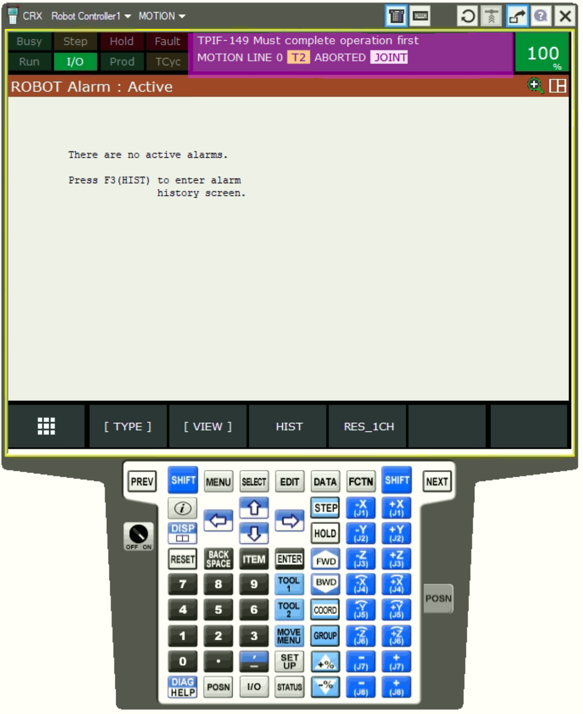
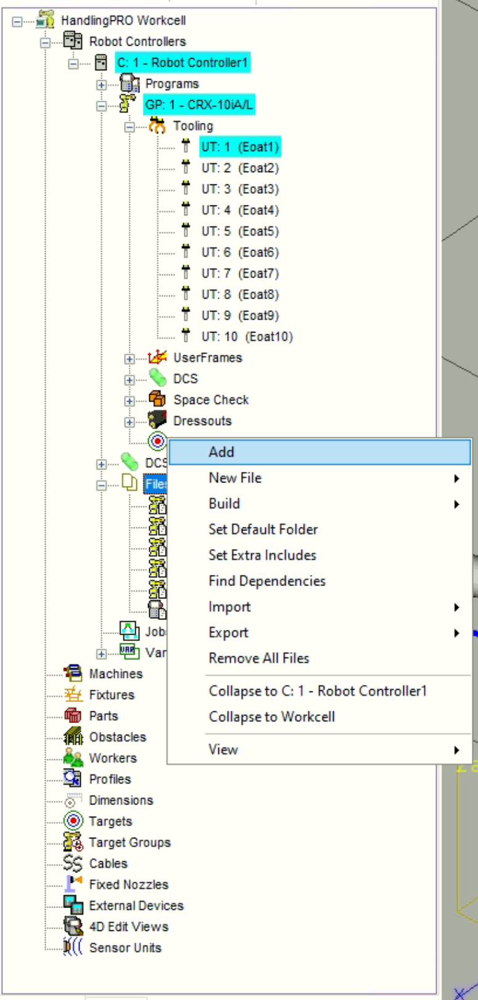
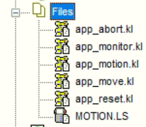
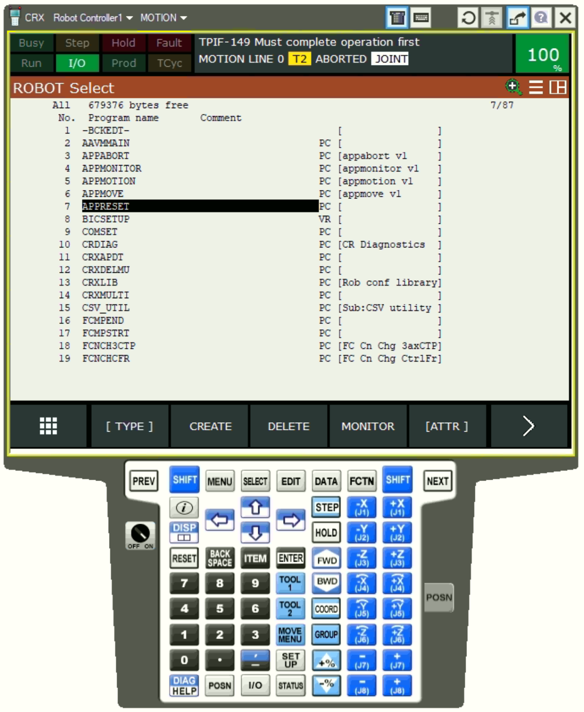
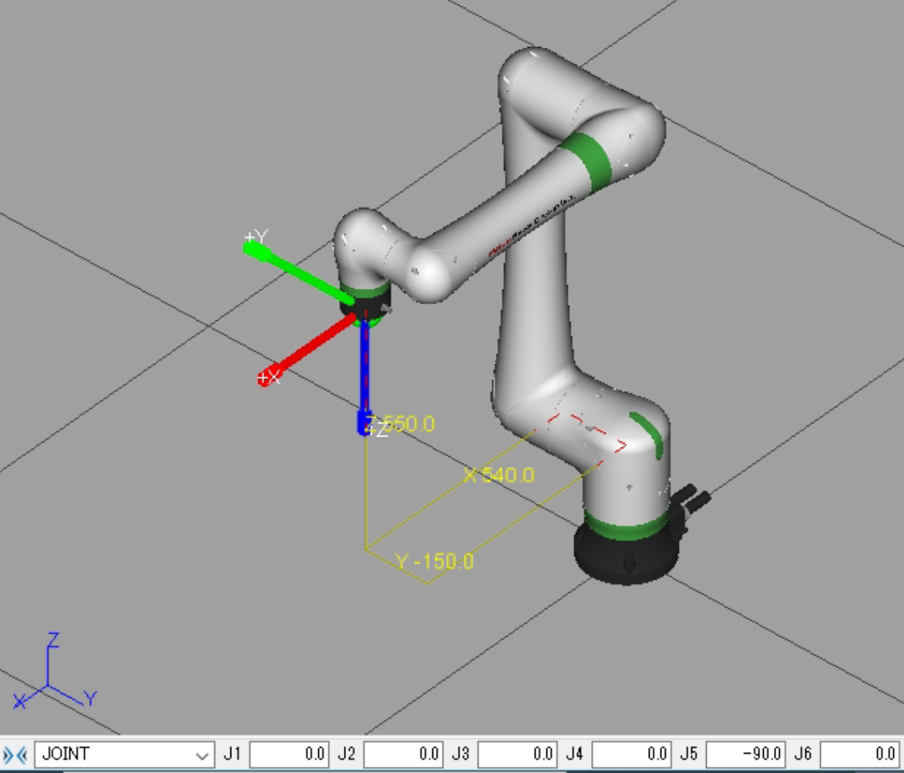
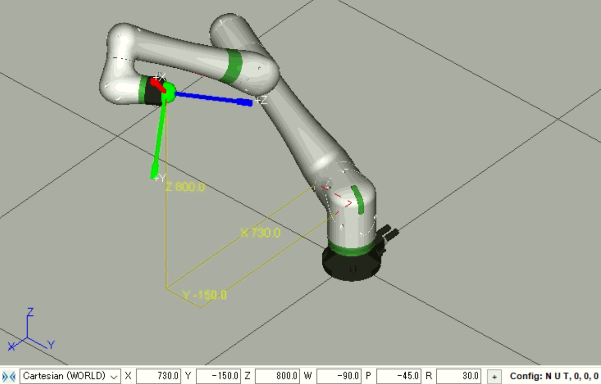

# cpsFanucInterface

## Acknowledgements
* The HTTP interface is adapted based on the [Ellis](https://github.com/afeldman/Ellis) repository by Anton Feldmann.
* We would also like to thank Bernd Klein from FANUC for his guidance and support in development.

## ROBOGUIDE Setup
* Create New Project - Default options are okay except for the following steps:
    * Step 2: Workcell Name -- Choose a name
    * Step 6: Group 1 Robot Model -- Purchased robot is H753 LR Mate 200iD/7L (R-30iB+ Mate Controller)
    * Step 8: Robot Options -- Add the following
        * KAREL (R632)
        * User Socket Msg (R648)
        * Dyn Path Modifier (R739)

## Setting the Teach Pendant to Wide View
When navigating the Teach Pendant (in either ROBOGUIDE or the real robot), it is helpful to set it to wide view mode. It can be done as follows.
* On the Teach Pendant, tap or click in the area highlighted in purple as shown.
    
* Click or tap on `[VIEW]` and select Wide

## Compiling & Installing KAREL programs

Programs can be compiled and loaded onto virtual robot controllers in ROBOGUIDE as follows. Once compiled, they can be copied onto a flash drive and uploaded to real physical robots.

### Compiling and Installing in Roboguide
* Open the target robot project
* Add the source files (.kl for KAREL code, .ls for Teach Pendant code) by right clicking Files -> Add in the cell browser

    * For the HTTP interface, add all the KAREL wrapper files in `karel/http` and the motion backend `MOTION.LS` from `karel/motion`.
    
* Right click Files -> Build -> All. There should be no errors.
* (Optional) Ensure that the programs are installed by looking for them in the Teach Pendant. Press SELECT to bring up the program menu. Ensure KAREL programs are desplayed by selecting `[TYPE]` -> ALL.

* The HTTP interface should now be working

### In Real Robot
The compiled programs need to be uploaded to the real robots, which can be done as follows. Ensure the programs are built, as described in the `Compiling and Installing in Roboguide` section.
* Copy the compiled `.pc` files (for KAREL) and `.TP` file (For Teach Pendant) onto a FAT32 flash drive. The compiled files can be found next to the source files (in `karel/http` and `karel/motion`).
* Once the transfer is complete, attach the flash drive to the physical Teach Pendant.
* On the Teach Pendant, select MENU -> FILE -> FILE
* Select `[UTIL]` -> Set Device -> USB on TP
* Select LOAD -> (all files)
* Select all the copied `.pc` and `.TP` files to load then.
* (Optional) Ensure that the programs are installed by looking for them in the Teach Pendant. Press SELECT to bring up the program menu. Ensure KAREL programs are desplayed by selecting `[TYPE]` -> ALL.

* The HTTP interface should now be working on the physical robot

## HTTP Interface
Commands can be sent to the HTTP interface using HTTP requests sent from a browser or Python script specifying the IP address of the robot (127.0.0.1 works if the robot is running in ROBOGUIDE on the same machine and will be used in these examples) as follows.

`127.0.0.1/KAREL/[command]`

where `[command]` can be the following.
* `appreset` - Initiate a fault reset (For example, after an unreachable position was sent to the robot). This is equivalent to clicking the fault reset button in ROBOGUIDE or pressing shift + reset on the Teach Pendant.
* `appmove` - Update position register target, `appmotion` must be called before to start the motion backend, and the Teach Pendant must be switched off. For more details, see the readme of [Ellis](https://github.com/afeldman/Ellis).
    * To send joint commands, use the `jja` option, as follows:
    `http://127.0.0.1/KAREL/appmove?motion_t=jja&coord1=0.0&coord2=0.0&coord3=0.0&coord4=0.0&coord5=-90.0&coord6=0.0`
    
    * To send commands in world frame (absolute position offsets in mm from the robot frame origin), use the `lca` option, as follows.
    `http://127.0.0.1/KAREL/appmove?motion_t=lca&coord1=730&coord2=-150.0&coord3=800&coord4=-90.0&coord5=-45.0&coord6=30.0`
    
    * It should be noted that currently, the wrapper will return a successful status even if the motion was unreachable. An unreachable position can be found via the error state returned by `appmonitor` or by looking at the teach Pendant. The robot should be reset (via 'appreset' or the teach Pendant) if the robot reaches a fault state.
* `appmotion` - Starts the motion backend
* `appmonitor` - Retrieves the robot position and error state in JSON format
    * A normal state response looks like the following: `{ "joint": [ 0.00000E+00, 0.00000E+00, 0.00000E+00, 0.00000E+00, -9.00000E+01, 0.00000E+00 ], "position": [ 5.40000E+02, -1.50000E+02, 5.50000E+02, -1.80000E+02, 2.50448E-06, 0.00000E+00 ], "error": [ 0,"R E S E T " ] }`
    * An error state response looks like the following: `{ "joint": [ 0.00000E+00, 0.00000E+00, 0.00000E+00, 0.00000E+00, -9.00000E+01, 0.00000E+00 ], "position": [ 5.40000E+02, -1.50000E+02, 5.50000E+02, -1.80000E+02, 2.50448E-06, 0.00000E+00 ], "error": [ 15018,"MOTN-018 Position not reachable (G:1) " ] }`
* `appabort` - Stops any running robot tasks, such as the motion backend. This is equivalent to pressing FCTN -> ABORT(ALL) on the Teach Pendant.

If you are prompted to login when invoking HTTP requests, it is required to set the HTTP authentication to unlocked, which can be done as follows.
* Open Teach Pendant
* Menu -> Setup -> Host Comm (Should be under window 2 number 9 if no additional options were chosen in Setup Step 8)
* Select HTTP
* Set Karel to UNLOCK
    
## Setup DPM
*  Follow the DPM and Host Comm sections under [Configuration guide](https://github.com/gavanderhoorn/fanuc_dpm_mouse_demo) from the FANUC DPM Mouse Demo
* Set U Frame
    * Menu -> 6. Setup -> 4. Frames
    * Choose [Other] -> 3. User Frames
    * Select SETIND and select 1

## Requesting Commands via Socket Messaging
WIP